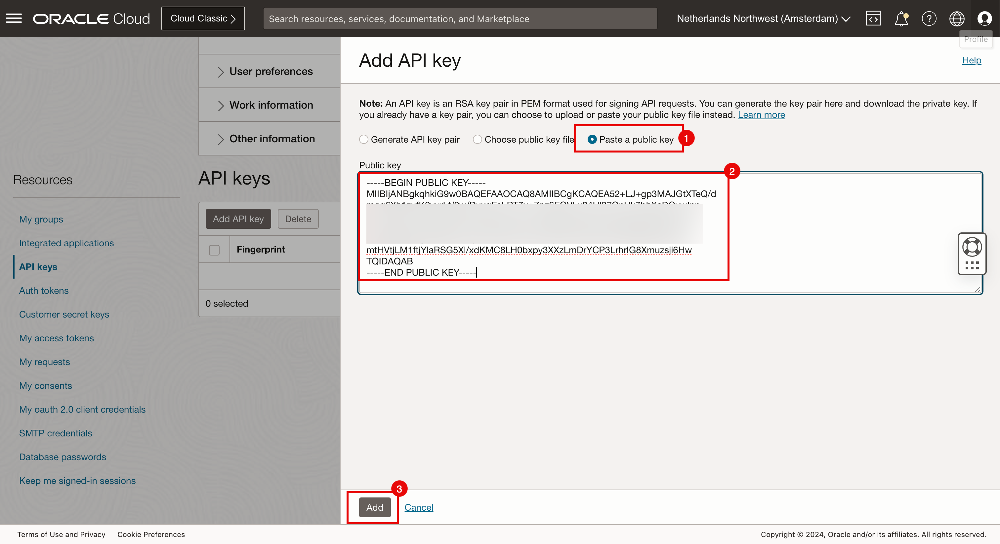
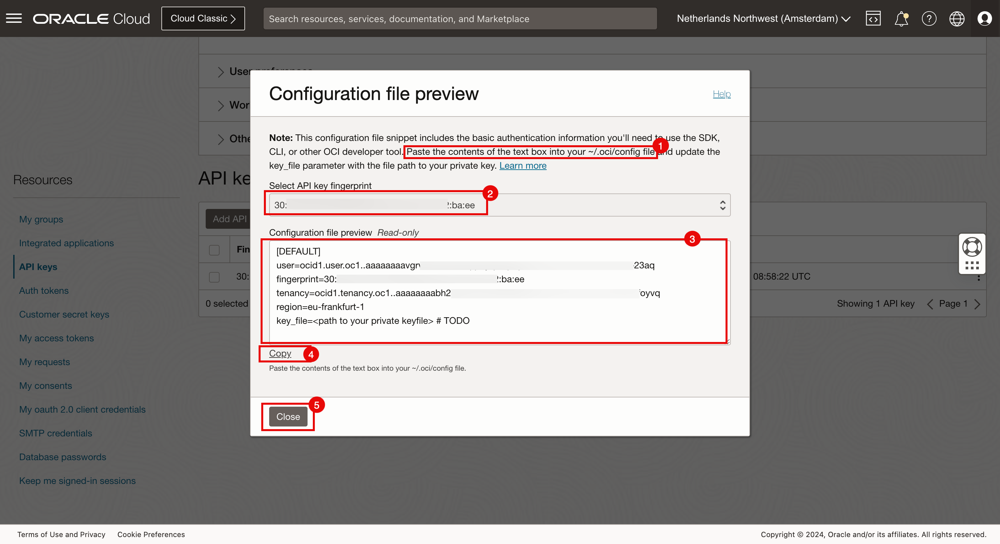
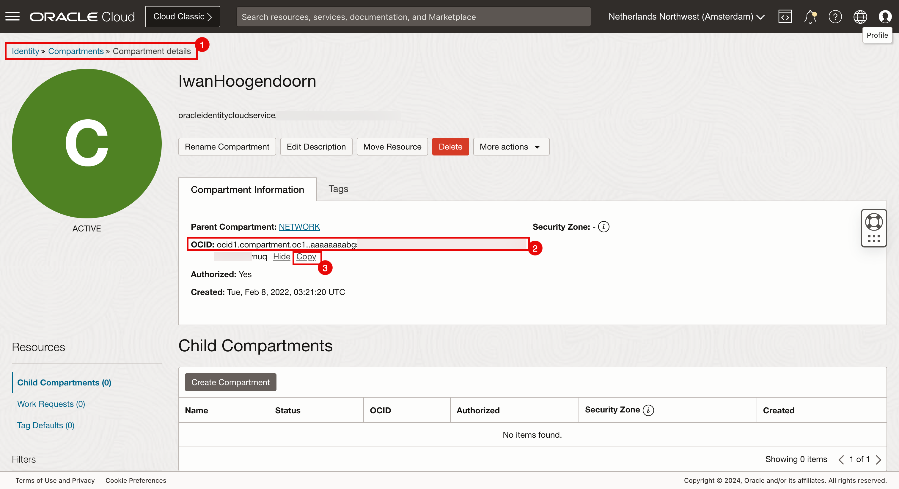

- [Setup kubernetes cluster (OCI)](#setup-kubernetes-cluster-oci)
    - [1. Create OCI api key](#1-create-oci-api-key)
    - [2. Create a new API key in the OCI console](#2-create-a-new-api-key-in-the-oci-console)
    - [3. Collect OCI info](#3-collect-oci-info)
    - [4. Add ssh public key to OCI VMs](#4-add-ssh-public-key-to-oci-vms)
    - [5. Goto k8s folder](#5-goto-k8s-folder)
    - [6. Update terraform.tfvars with OCI info, VMs info](#6-update-terraformtfvars-with-oci-info-vms-info)
    - [7. Apply k8s](#7-apply-k8s)
    - [8. \[Optional\] Destroy k8s](#8-optional-destroy-k8s)


# Setup kubernetes cluster (OCI)

**Prerequisites:** `openssl` installed

### 1. Create OCI api key

```bash
openssl genrsa -out oci-api-key.pem 2048
chmod 600 oci-api-key.pem
openssl rsa -pubout -in oci-api-key.pem -out oci-api-key.pub.pem
```

### 2. Create a new API key in the OCI console



Copy to `~/.oci/config`:



Replace `key_file=<path to your private keyfile> # TODO` with the path to your private keyfile `oci-api-key.pem`

### 3. Collect OCI info



### 4. Add ssh public key to OCI VMs

```bash
# ssh to VMs, copy public key to authorized_keys
echo "some-ssh-public-key" >> ~/.ssh/authorized_keys
# check if key is added
cat ~/.ssh/authorized_keys
```

### 5. Goto k8s folder

```bash
cd k8s
```

### 6. Update terraform.tfvars with OCI info, VMs info

```hcl
# terraform.tfvars
ocis = [
  {
    name             = "name"
    user             = "ocid-of-user"
    fingerprint      = "fingerprint-of-oci"
    tenancy          = "ocid-of-tenancy"
    region           = "ap-singapore-1"
    api_key_path     = "/path/to/oci-api-key.pem"
    api_pub_key_path = "/path/to/oci-api-key.pub.pem"
    instances = [
      {
        id               = "ocid1"
        name             = "node-1"
        is_control_plane = true
      },
      {
        id               = "ocid2"
        name             = "node-2"
        is_control_plane = false
      }
    ]
  }
]
ssh_private_key = "/path/to/ssh-private-key" # default is ~/.ssh/id_rsa
```

### 7. Apply k8s

```bash
terraform init -reconfigure -upgrade
terraform apply
```

### 8. [Optional] Destroy k8s

```bash
terraform destroy
```