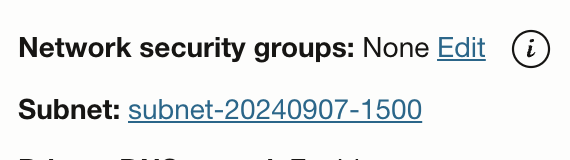
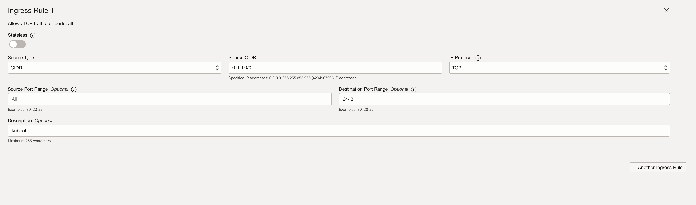

- [Setup kubernetes cluster (OCI)](#setup-kubernetes-cluster-oci)
    - [1. Create OCI api key](#1-create-oci-api-key)
    - [2. Add that API key to the OCI console](#2-add-that-api-key-to-the-oci-console)
    - [3. Collect OCI info](#3-collect-oci-info)
    - [4. Add ssh public key to OCI VMs](#4-add-ssh-public-key-to-oci-vms)
    - [5. Go to subnet of VMs, add option to security list to allow communication between VMs](#5-go-to-subnet-of-vms-add-option-to-security-list-to-allow-communication-between-vms)
    - [6. Attach Shared Volume to VMs](#6-attach-shared-volume-to-vms)
    - [7. Goto k8s folder](#7-goto-k8s-folder)
    - [8. Update terraform.tfvars with OCI info, VMs info](#8-update-terraformtfvars-with-oci-info-vms-info)
    - [9. Apply k8s](#9-apply-k8s)
    - [10. \[Optional\] Destroy k8s](#10-optional-destroy-k8s)
- [Access the kubernetes cluster](#access-the-kubernetes-cluster)
    - [1. Add ingress rules to security list of controller VM to allow kubectl to access the cluster](#1-add-ingress-rules-to-security-list-of-controller-vm-to-allow-kubectl-to-access-the-cluster)
    - [2. Allow ports in firewall of controller VM, fix ethtool cilium\_vxlan, iptables](#2-allow-ports-in-firewall-of-controller-vm-fix-ethtool-cilium_vxlan-iptables)
    - [3. Get the kubeconfig file `~/.kube/oci_config`](#3-get-the-kubeconfig-file-kubeoci_config)
    - [4. Tunnel to a node that's control plane](#4-tunnel-to-a-node-thats-control-plane)
    - [5. Now you can use `kubectl` to access the cluster](#5-now-you-can-use-kubectl-to-access-the-cluster)


# Setup kubernetes cluster (OCI)

**Prerequisites:**
- `openssl` installed
- list of VMs in OCI already created
- list of Network Load Balancers (NLB) in OCI already created and their backend sets point to the VMs

### 1. Create OCI api key

```bash
openssl genrsa -out oci-api-key.pem 2048
chmod 600 oci-api-key.pem
openssl rsa -pubout -in oci-api-key.pem -out oci-api-key.pub.pem
```

### 2. Add that API key to the OCI console


### 3. Collect OCI info


Copy to `~/.oci/config`

Replace `key_file=<path to your private keyfile> # TODO` with the path to your private keyfile `oci-api-key.pem`

### 4. Add ssh public key to OCI VMs

```bash
# ssh to VMs, copy public key to authorized_keys
echo "some-ssh-public-key" >> ~/.ssh/authorized_keys
# check if key is added
cat ~/.ssh/authorized_keys
```

### 5. Go to subnet of VMs, add option to security list to allow communication between VMs




### 6. Attach Shared Volume to VMs

- Create shared block volume in OCI
- Attach the volume to VMs
- Follow the instruction [https://blogs.oracle.com/cloud-infrastructure/post/using-the-multiple-instance-attach-block-volume-feature-to-create-a-shared-file-system-on-oracle-cloud-infrastructure](https://blogs.oracle.com/cloud-infrastructure/post/using-the-multiple-instance-attach-block-volume-feature-to-create-a-shared-file-system-on-oracle-cloud-infrastructure)

### 7. Goto k8s folder

```bash
cd k8s
```

### 8. Update terraform.tfvars with OCI info, VMs info

Get values from OCI console and `~/.oci/config`

`ssh_private_key` is the private key of public key added to VMs in step [4. Add ssh public key to OCI VMs](#4-add-ssh-public-key-to-oci-vms)

```hcl
# terraform.tfvars
ocis = [
  {
    name             = "name"
    user             = "ocid-of-user"
    fingerprint      = "fingerprint-of-oci"
    tenancy          = "ocid-of-tenancy"
    region           = "ap-singapore-1"
    api_key_path     = "/path/to/oci-api-key.pem"
    api_pub_key_path = "/path/to/oci-api-key.pub.pem"
    instances = [
      {
        id               = "ocid1"
        name             = "node-1"
        is_control_plane = true
      },
      {
        id               = "ocid2"
        name             = "node-2"
        is_control_plane = false
      }
    ],
    nlbs = [{
      id   = "ocid-of-nlb"
      name = "nlb-1"
    }]
  }
]
ssh_private_key = "/path/to/ssh-private-key" # default is ~/.ssh/id_rsa
registry_htpasswd = "your-password-for-registry"
```

### 9. Apply k8s

```bash
# inside k8s/ folder
terraform init -reconfigure -upgrade
terraform apply
```

### 10. [Optional] Destroy k8s

```bash
# inside k8s/ folder
terraform destroy
```

# Access the kubernetes cluster

### 1. Add ingress rules to security list of controller VM to allow kubectl to access the cluster



### 2. Allow ports in firewall of controller VM, fix ethtool cilium_vxlan, iptables

```bash
# oracle linux 8, ref: https://linuxconfig.org/redhat-8-open-and-close-ports
sudo firewall-cmd --permanent --zone=public --add-service=http --add-service=https
sudo firewall-cmd --permanent --zone=public \
  --add-port 80/tcp \
  --add-port 443/tcp \
  --add-port 51820/udp \
  --add-port 6443/tcp \
  --add-port 2379-2380/tcp \
  --add-port 9254/tcp \
  --add-port 10250/tcp \
  --add-port 10256/tcp \
  --add-port 10257/tcp \
  --add-port 10259/tcp \
  --add-port 30000-32767/tcp \
  --add-port 25/tcp \
  --add-port 465/tcp \
  --add-port 587/tcp \
  --add-port 143/tcp \
  --add-port 993/tcp \
  --add-port 110/tcp \
  --add-port 995/tcp
sudo firewall-cmd --permanent --zone=trusted --add-source=10.0.0.0/8
sudo firewall-cmd --reload
sudo firewall-cmd --zone=public --list-all # check
sudo firewall-cmd --zone=trusted --list-all # check
# fix ethtool cilium_vxlan or calico vxlan
sudo ethtool --offload cilium_vxlan tx-checksum-ip-generic off
sudo ethtool --offload vxlan.calico rx off tx off
# fix iptables
sudo iptables -P INPUT ACCEPT
sudo iptables -P FORWARD ACCEPT
sudo iptables -P OUTPUT ACCEPT
sudo iptables -F
```

### 3. Get the kubeconfig file `~/.kube/oci_config`

Use `rsync` to a VM (node) that's control plane to copy the file

```bash
rsync -chavzP --stats --rsync-path="sudo rsync" opc@control-plane-node-public-ip:/etc/kubernetes/admin.conf ~/.kube/oci_config
```

Ref: [https://github.com/kubernetes-sigs/kubespray/blob/master/docs/getting_started/setting-up-your-first-cluster.md#access-the-kubernetes-cluster](https://github.com/kubernetes-sigs/kubespray/blob/master/docs/getting_started/setting-up-your-first-cluster.md#access-the-kubernetes-cluster)

### 4. Tunnel to a node that's control plane

```bash
ssh -L6443:localhost:6443 opc@control-plane-node-public-ip
```

### 5. Now you can use `kubectl` to access the cluster

```bash
export KUBECONFIG=~/.kube/oci_config
kubectl get nodes
kubectl get pods --all-namespaces
```